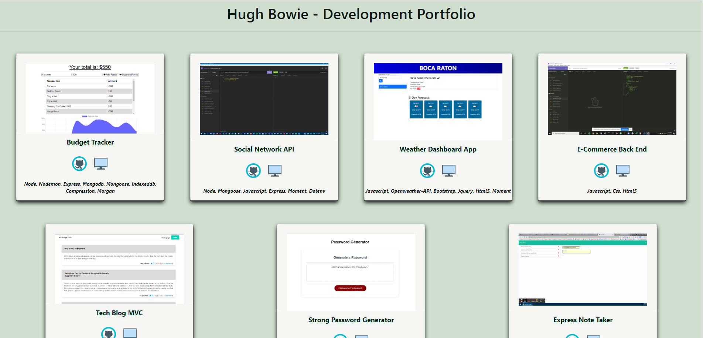

<h1 align="center">React Developer Portfolio🚀</h1>

<p align="center">
    
    
    
    

</p>
<p align="center">
    
    
    
    
    
    
    
</p>

## 📓 Description

This project was bootstrapped with Create React App. A personal full stack
development portfolio.

#### [react-portfolio.herokuapp](https://react-portfolio-hb.herokuapp.com/#/portfolio)

## 🎬 Screenshot



## 🃏 User Story

```
AS AN employer looking for candidates with experience building single-page applications
I WANT to view a potential employee's deployed React portfolio of work samples
SO THAT I can assess whether they're a good candidate for an open position
```

## ✔️ Accpetance Criteria

```
GIVEN a single-page application portfolio for a web developer
WHEN I load the portfolio
THEN I am presented with a page containing a header, a section for content, and a footer
WHEN I view the header
THEN I am presented with the developer's name and navigation with titles corresponding to different sections of the portfolio
WHEN I view the navigation titles
THEN I am presented with the titles About Me, Portfolio, Contact, and Resume, and the title corresponding to the current section is highlighted
WHEN I click on a navigation title
THEN I am presented with the corresponding section below the navigation without the page reloading and that title is highlighted
WHEN I load the portfolio the first time
THEN the About Me title and section are selected by default
WHEN I am presented with the About Me section
THEN I see a recent photo or avatar of the developer and a short bio about them
WHEN I am presented with the Portfolio section
THEN I see titled images of six of the developer’s applications with links to both the deployed applications and the corresponding GitHub repository
WHEN I am presented with the Contact section
THEN I see a contact form with fields for a name, an email address, and a message
WHEN I move my cursor out of one of the form fields without entering text
THEN I receive a notification that this field is required
WHEN I enter text into the email address field
THEN I receive a notification if I have entered an invalid email address
WHEN I am presented with the Resume section
THEN I see a link to a downloadable resume and a list of the developer’s proficiencies
WHEN I view the footer
THEN I am presented with text or icon links to the developer’s GitHub and LinkedIn profiles, and their profile on a third platform (Stack Overflow, Twitter)
```

## 📋 Table of Contents

- [Description](#description)
- [Screenshot](#Screenshot)
- [User Story](#user-story)
- [Acceptance Criteria](#acceptance-criteria)
- [Table of Contents](#table-of-contents)
- [Installation](#installation)
- [Usage](#usage)
- [Contributing](#contributing)
- [Questions](#questions)

## 🛠 Installation

`npm init` `npm install`

## ▶️ Useage

`npm start`

## 🍻 Contributing

:octocat: [Hugh Bowie](https://github.com/hugh-bowie)

## ⁉️ Questions

Contact me with any questions:
[hughbowie@me.com](mailto:hughbowie@me.com)<br />[GitHub](https://github.com/hugh-bowie)<br />
